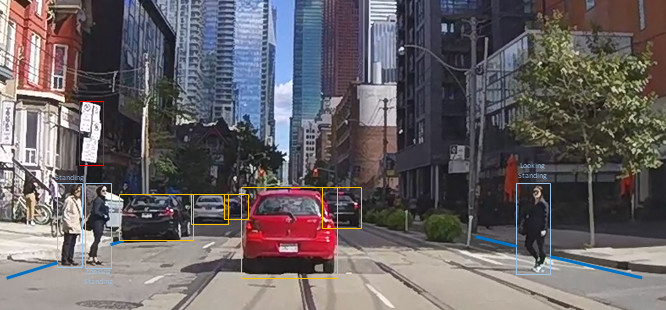

# PIE annotations
<p align="center">

</p>
<br/><br/>

This repository contains  annotations for the Pedestrian Intention Estimation ([PIE](http://data.nvision2.eecs.yorku.ca/PIE_dataset/)) dataset. The annotations are in XML format and are accompanied by a python interface for processing. 

**Paper:** A. Rasouli, I. Kotseruba, T. Kunic, J.K. Tsotsos, PIE: A Large-Scale Dataset and Models for Pedestrian Intention Estimation, ICCV, 2019 (Oral) [pdf](https://openaccess.thecvf.com/content_ICCV_2019/papers/Rasouli_PIE_A_Large-Scale_Dataset_and_Models_for_Pedestrian_Intention_Estimation_ICCV_2019_paper.pdf)

**Download links for videos:** [YorkU server](http://data.nvision2.eecs.yorku.ca/PIE_dataset/PIE_clips/)

### Table of contents
* [Annotations](#annotations)
	* [Spatial annotations](#spatial)
	* [Object attributes](#attributes)
	* [Ego-vehicle information](#vehicle)
* [Video clips](#clips)
* [Data interface](#interface)
	* [Dependencies](#dependencies)
	* [Extracting images](#extracting)
	* [Using the interface](#usage)
		* [Parameters](#parameters)
		* [Sequence analysis](#sequence)
* [Citation](#citation)
* [Authors](#authors)
* [License](#license)

<a name="annotations"></a>
# Annotations

There are three types of annotations in the PIE dataset: spatial annotations with text labels, object attributes, ego-vehicle information <br/>

<a name="spatial"></a>
### Spatial annotations
Spatial annotations are organized according to sets and video clip names. Six types of objects (pedestrian, vehicle, traffic_light, sign, crosswalk, transit station) are annotated with bounding boxes and each has a unique id in the form of `<set_id>_<video_id>_<object_id>`, e.g. pedestrian with id `1_2_50` is found in video 2 of set 1. Object ids for traffic infrastructure objects are also tagged with the the initials of the corresponding object, e.g. `tl` for traffic lights. 

Objects are annotated with bounding boxes using two-point coordinates (top-left, bottom-right) `[x1, y1, x2, y2]`. The bounding boxes for pedestrians have corresponding occlusion tags with the following numeric values: 
- 0 - not occluded (pedestrian is fully visible or <25% of the bbox area is occluded);
- 1 - partially occluded (between 25% and 75% of the bbox area is occluded)
- 2 - fully occluded (>75% of the bbox area is occluded). 

Other types of objects have binary occlusion labels: 0 (fully visible) or 1 (partially or fully occluded).

Depending on the type of object additional information is provided for each bounding box (where applicable):
* pedestrian - textual labels for actions, gestures, looking, or crossing
    * Action: Whether the pedestrian is `walking` or `standing`
    * Gesture: The type of gestures exhibited by the pedestrian. The gestures include  
    `hand_ack` (pedestrian is acknowledging by hand gesture),`hand_yield` (pedestrian is yielding by hand gesture), 
    `hand_rightofway` (pedestrian is giving right of way by hand gesture), `nod`, or `other`.
    * Look: Whether pedestrian is `looking` or `not-looking` in the direction of the ego-vehicle.
    * Cross: Whether pedestrian is `not-crossing`, `crossing` the path of the ego-vehicle and `crossing-irrelevant` which indicates that the pedestrian is crossing the road but not in the path of the ego-vehicle.
* vehicle
    * Type: The type of vehicle. The options are `car`, `truck`, `bus`, `train`, `bicycle` and `bike`.<br/>
* traffic_light
    * Type: The type of traffic light. The options are `regular`, `transit` (specific to buses and trains) and `pedestrian`.
    * State: The state of the traffic light. The options are `red`, `yellow` and `green`.
* sign
    * Type: The type of sign. The options are `ped_blue`, `ped_yellow`, `ped_white`, `ped_text`, `stop_sign`, `bus_stop`, `train_stop`, `construction`, `other`.
* crosswalk - none
* transit_station
    * bus or streetcar station

<a name="attributes"></a>
### Object attributes
These include information regarding pedestrians' demographics, crossing point, crossing characteristics, etc. 
This information is provided for each pedestrian track:
* age: `child`, `adult` or `senior`.
* gender: `male` or `female`.
* id: Pedestrian's id.
* num_lanes: Scalar value, e.g. 2, 4, indicating the number of lanes at the point of crossing
* signalized: Indicates whether the crosswalk is signalized. Options are `n/a` (no signal, no crosswalk), `C` (crosswalk lines or pedestrian crossing sign), `S` (signal or stop sign) and `CS` (crosswalk or crossing sign combined with traffic lights or stop sign).
* traffic_direction: `OW` (one-way) or `TW` (two-way).
* intersection: Specifies the type of intersection: `midblock`, `T`, `T-right`, `T-left`, `four-way`.
* crossing: `1` (crossing), `0` (not crossing), `-1` (irrelevant). This indicates whether the pedestrian was observed crossing the road in front of the ego-vehicle. Irrelevant pedestrians are those judged as not intending to cross but standing close to the road, e.g. waiting for a bus or hailing a taxi.
* exp_start_point: The starting frame of the clip used for human experiment (see the paper for details)
* critical_point: The last frame of the clip used for human experiment
* intention_prob: A value in range `[0,1]` indicating the average human responses for the pedestrian's intention. This value is estimated intention of a given pedestrian to cross *prior to the critical point*. Therefore, there is a *single intention estimate per each pedestrian track*.
* crossing_point: The frame at which the pedestrian starts crossing. In the cases where the pedestrians do not cross the road, the last frame - 3 is selected. 

**Note regarding action/intention distinction**: In the PIE dataset we distinguish between intention to cross and crossing action. We consider intention as a mental state that precedes the action but does not necessarily cause the action immediately, e.g. if it is dangerous to do so. In the case of crossing the road this leads to three possible scenarios:

- Pedestrian intends (wants) to cross and crosses because the conditions are favorable (e.g. green light for pedestrian or the ego-vehicle yields);
- Pedestrian intends to cross but cannot cross since the conditions prevent them from doing so (e.g. red light, being blocked by other pedestrians or vehicles not yielding);
- Pedestrian does not intend to cross (e.g. is talking to another person or waiting for a bus at the bus station) and therefore does not cross.

These examples illustrate that intention and action are related but are not the same. However, in the literature, these terms are often used interchangeably. Therefore, when using PIE or comparing the results of the models trained on PIE dataset it is important to understand the difference and clarify what data was used for training. 

Note that the volume of training data available for action and intention is different. Action labels (moving, crossing, looking, gesturing) are provided for each bounding box in the pedestrian track (where applicable). An intention label is provided only for a set of frames *preceding the observed action* (crossing or not crossing).

In general, models that are trained on action labels will not be comparable to models trained on intention labels and will not output the same results. For example, intention estimation sub-model in [PIEPredict](https://github.com/aras62/PIEPredict) is trained on intention data (i.e. only on frames preceding the crossing action and on intention labels) and predicts intention to cross, not action. It will classify pedestrian waiting at the red traffic light as *intending to cross* even though the pedestrian is not observed crossing. An action prediction algorithm (e.g. [PCPA](https://github.com/ykotseruba/PedestrianActionBenchmark)) in this case will output *not crossing* action. Both outputs are correct but mean different things and should not be compared. 

<a name="vehicle"></a>
### Ego-vehicle information
Ego-vehicle information is OBD sensor output provided per-frame. The following properties are available:
 `GPS_speed` (km/h), `OBD_speed` (km/h), `heading_angle`, `latitude`, `longitude`, `pitch`, `roll`, `yaw`, `acceleration` and `gyroscope`.<br/>

<a name="clips"></a>
# Video clips
PIE contains 53 video clips split into 6 sets. The clips in each set are continuous, meaning that they belong to a single recording that is divided into chunks. Each video is approximately 10 min long. These clips should be downloaded and placed in `PIE_clips` folder as follows:
```
PIE_clips/set01/video_0001.mp4
PIE_clips/set01/video_0002.mp4
...
```
To download the videos, either run script `download_clips.sh` or manually download the clips from [here](http://data.nvision2.eecs.yorku.ca/PIE_dataset/PIE_clips/).

<a name="interface"></a>
# Data interface

Data interface is provided for loading and filtering the annotations for training models.

<a name="dependencies"></a>
## Dependencies
The interface is written and tested using python 3.5. The interface also requires
the following external libraries:<br/>
* opencv-python
* numpy
* scikit-learn

<a name="extracting"></a>
## Extracting images
In order to use the data, first, the video clips should be converted into images. 
There are to options to extract the images. The first option is to use script `split_clips_to_frames.sh`.
This script will extract all images from the video clips. Note that this would require approx.  3TB space to save the images. Alternatively, one can use the interface to only extract annotated frames  (which would require 1TB space) as follows:

```
from pie_data import PIE
pie_path = <path_to_the_root_folder>
imdb = PIE(data_path=pie_path)
imdb.extract_and_save_images(extract_frame_type='annotated')
```

Using either of the methods will create a folder called `images` and save the extracted 
images grouped by corresponding video ids in the folder.
```
images/set01/video_0001/
								00000.png
								00001.png
								...
images/set01/video_0002/
								00000.png
								00001.png
								...		
...
```

<a name="usage"></a>
## Using the interface
<a name="parameters"></a>
Upon using any methods to extract data, the interface first generates a database (by calling `generate_database()`) of all annotations in the form of a dictionary and saves it as a `.pkl` file in the cache directory (the default path is `PIE/data_cache`). For more details regarding the structure of the database dictionary see comments in the `pie_data.py` for function `generate_database()`.

### Parameters
The interface has the following configuration parameters:
```
data_opts = {'fstride': 1,
             'data_split_type': 'default',
             'seq_type': 'trajectory',
	     			 'height_rng': [0, float('inf')],
	     			 'squarify_ratio': 0,
             'min_track_size': 0,
             'random_params': {'ratios': None,
                               'val_data': True,
                               'regen_data': True},
             'kfold_params': {'num_folds': 5, 'fold': 1}}
```
`fstride`.  This is used for sequence data. The stride specifies the sampling resolution, i.e. every nth frame is used
for processing.<br/>
`data_split_type`. The PIE data can be split into train/test or val in three different ways. `default` uses the predefined train/val/test split specified in `_get_image_set_ids()` method in `pie_data.py`. `random` randomly divides pedestrian ids into train/test (or val) subsets depending on `random_params` (see  method `_get_random_pedestrian_ids()` for more information). `kfold` divides the data into k sets for cross-validation depending on `kfold_params` (see  method `_get_kfold_pedestrian_ids()` for more information).<br/>
`seq_type`. Type of sequence data to generate (see [Sequence analysis](#sequence)).
`height_rng`. These parameters specify the range of pedestrian scales (in pixels) to be used. For example  `height_rng': [10, 50]` only uses pedestrians within the range of 10 to 50 pixels in height.<br/>
`squarify_ratio`. This parameter can be used to fix the aspect ratio (width/height) of bounding boxes. `0` the original bounding boxes are returned.<br/>
`min_track_size`. The minimum allowable sequence length in frames. Shorter sequences will not be used.


<a name="sequence"></a>
### Sequence analysis
There are three built-in sequence data generators accessed via `generate_data_trajectory_sequence()`.
The type of sequences generated are `trajectory`, `intention` and `crossing`.
To create a custom data generator, follow a similar structure and add a function call to `generate_data_trajectory_sequence()`
in the interface.

<a name="citation"></a>
# Citation
If you use our dataset, please cite:
```
@InProceedings{Rasouli_2019_ICCV,
author = {Rasouli, Amir and Kotseruba, Iuliia and Kunic, Toni and Tsotsos, John K.},
title = {PIE: A Large-Scale Dataset and Models for Pedestrian Intention Estimation and Trajectory Prediction},
booktitle = {International Conference on Computer Vision (ICCV)},
year = {2019}
}

```
<a name="authors"></a>
## Authors

* **[Amir Rasouli](https://aras62.github.io/)**
* **[Iuliia Kotseruba](http://www.cse.yorku.ca/~yulia_k/)**

Please send an email to yulia_k@eecs.yorku.ca or arasouli.ai@gmail.com if there are any problems with downloading or using the data.

<a name="license"></a>
## License
This project is licensed under the MIT License - see the [LICENSE](LICENSE) file for details
