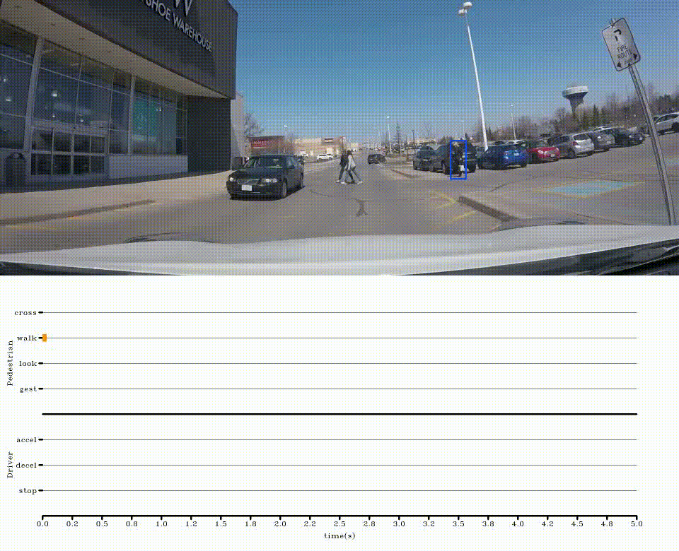
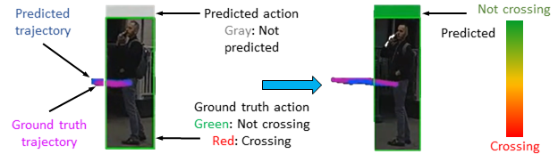
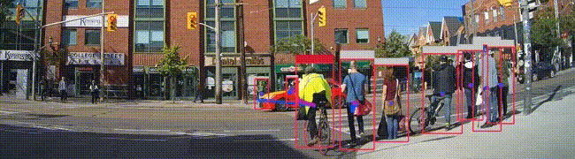

# Data and Model Visualization
This folder contains code for visualizing the content of the [PIE](https://data.nvision2.eecs.yorku.ca/PIE_dataset/) and [JAAD](https://data.nvision2.eecs.yorku.ca/JAAD_dataset/) 
datasets and trajectory and action prediction models' outputs.

### Visualization
For visualization, [PIE](../annotations/README.md#top) and [JAAD](https://github.com/ykotseruba/JAAD) annotations
and their data (images) are required. 

Visualization configurations are in ```.../utilities/configs.yaml``` and a sample script ```vis_scripts.py``` is provided 
with a series of functions for different types of visualization:

* ```data_visualize_behaviors()```: visualizes the behavioral labels (for both pedestrian and the drivers) of a given pedestrian sequence. 
Note that on PIE, the driver's behavior is inferred from the vehicle's sensors and are not fully tuned, therefore, are 
noisy.
<p align="center">

</p>

* ```visualize_data_label()```: visualizes a pedestrian sequence with corresponding 1 or 2 continuous
annotations (e.g. speed) and time in the form of a 2D/3D graph.
<p align="center">

</p>

* ```visualize_data_label_scenario()```: same as before for a given scenario
* ```model_visualize_traj_image()```: illustrates the output of a trajectory prediction model
on images at time ```t```. For this visualization, the sample model outputs in ```.../model_outputs``` can be used.
* ```model_visualize_cont_traj()``` and ```model_visualize_cont_act()```: visualizes the output of a trajectory or
action prediction model on a continuous video sequence. The models are applied to sequences extracted from the videos
via a moving window approach. All pedestrian samples with annotations are aggregated in the frames. For this visualization
**a model is requires** to process image sequences.
* ```model_visualize_cont_mt()```: same as before but for a multitasking method (e.g. similar to PedFormer) that
outputs both trajectory and action predictions. For this visualization **a model is requires** to process image sequences.
<p align="center">


</p>


### Citation
If you use the code for visualization of your data or models, please cite the following papers:
```
@InProceedings{Rasouli_2019_ICCV,
author = {Rasouli, Amir and Kotseruba, Iuliia and Kunic, Toni and Tsotsos, John K.},
title = {PIE: A Large-Scale Dataset and Models for Pedestrian Intention Estimation and Trajectory Prediction},
booktitle = {International Conference on Computer Vision (ICCV)},
year = {2019}
}

@inproceedings{Rasouli_2017_ICCVW,
  title={Are They Going to Cross? A Benchmark Dataset and Baseline for Pedestrian Crosswalk Behavior},
  author={Rasouli, Amir and Kotseruba, Iuliia and Tsotsos, John K},
  booktitle={International Conference on Computer Vision Workshop (ICCVW)},
  year={2017}
}
```

#### Disclaimer
This code has been tested on the **PIE** and **JAAD** datasets with the provided **model outputs** and [PedFormer](https://arxiv.org/pdf/2210.07886).
If you encounter any issues, please report for a solution. **Note that any changes to the code or configuration for evaluation on different datasets or
models are at the user's discretion and no support will be provided.**
